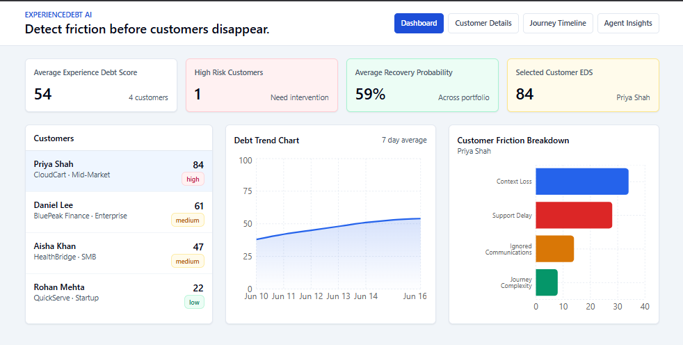
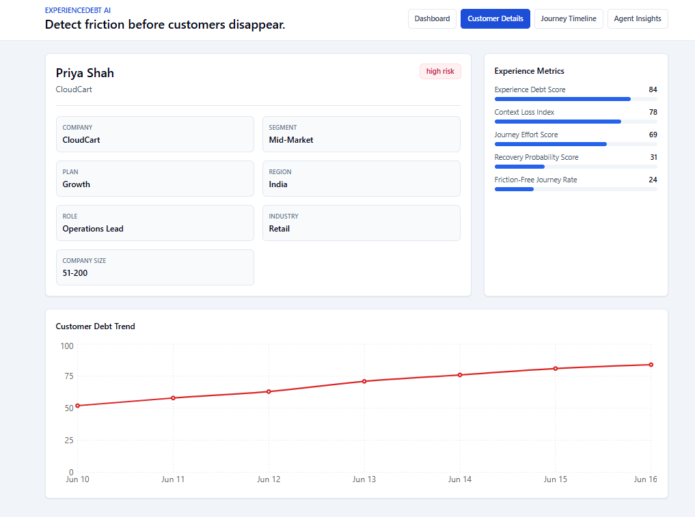
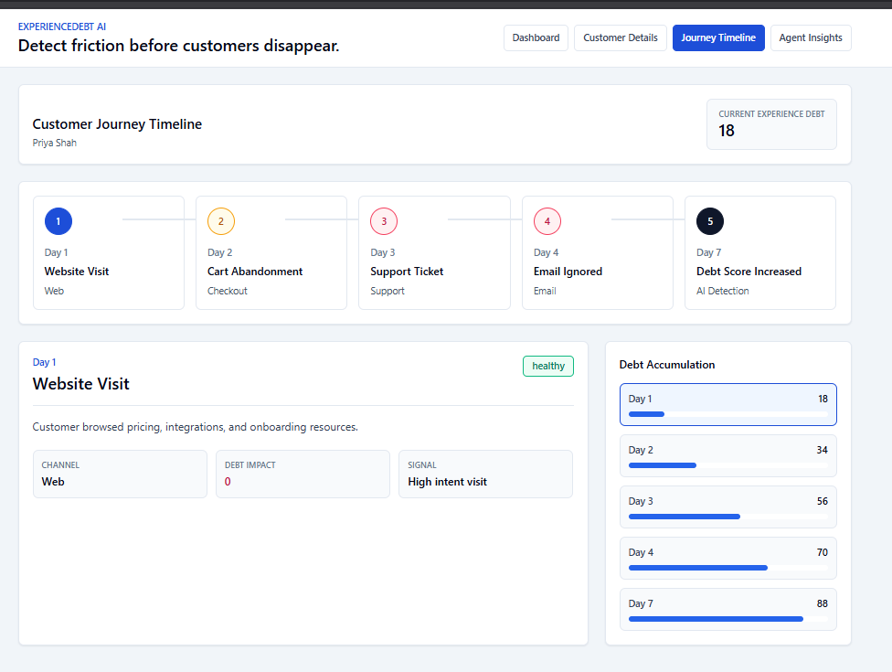
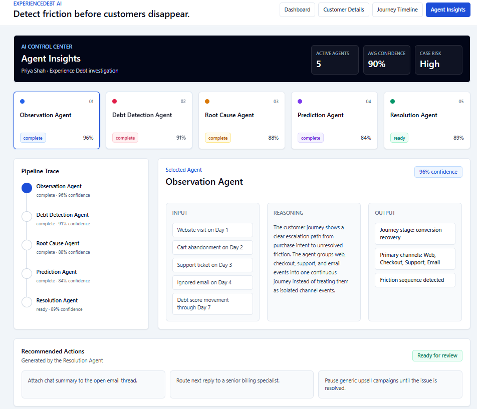
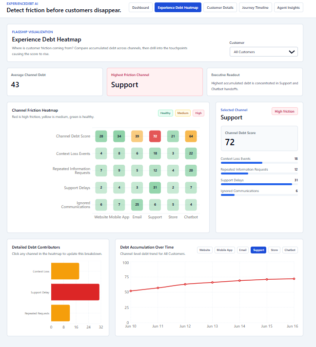

# ExperienceDebt AI

### Detect friction before customers disappear.

ExperienceDebt AI is an Agentic AI-powered customer experience intelligence platform that helps organizations identify, quantify, and reduce hidden customer friction across omnichannel journeys.

Unlike traditional analytics tools that focus on conversion rates, engagement metrics, and churn prediction, ExperienceDebt AI introduces a new concept:

**Customer Experience Debt (CED)**

Customer Experience Debt represents the accumulated friction customers experience throughout their journey, including repeated information requests, context loss between channels, delayed support responses, ignored communications, and complex workflows.

The platform enables businesses to detect friction before it results in customer dissatisfaction, disengagement, or churn.

---

## Problem Statement

Organizations today invest heavily in marketing automation, CRM platforms, customer support systems, and personalization engines.

Despite these investments, customers continue to experience fragmented interactions across websites, mobile applications, support channels, emails, and physical touchpoints.

Common friction points include:

* Repeating the same information across channels
* Losing context during support handoffs
* Delayed issue resolution
* Irrelevant communications
* Complex onboarding experiences

These seemingly small issues accumulate over time and silently damage customer relationships.

Traditional analytics solutions can identify when customers have already disengaged but rarely explain the hidden friction that caused the disengagement.

ExperienceDebt AI addresses this gap.

---

## Solution

ExperienceDebt AI continuously analyzes customer journeys and introduces a new framework for measuring customer friction.

The platform:

* Tracks customer interactions across channels
* Calculates Experience Debt Scores
* Detects context loss events
* Identifies root causes of friction
* Highlights high-risk customer journeys
* Provides AI-powered recommendations for intervention

---

## Core Metrics

### Experience Debt Score (EDS)

A proprietary score representing accumulated customer friction.

### Context Loss Index (CLI)

Measures how frequently customer context is lost across interactions and channels.

### Journey Effort Score (JES)

Quantifies the effort required for customers to complete their objectives.

### Recovery Probability Score (RPS)

Estimates the likelihood of restoring customer satisfaction after friction occurs.

### Friction-Free Journey Rate (FFJR)

Measures the percentage of journeys completed without major friction events.

---

## Agentic AI Architecture

The system is built using a multi-agent architecture.

### Observation Agent

Monitors customer journey events and interaction patterns.

### Debt Detection Agent

Calculates Customer Experience Debt based on journey signals.

### Root Cause Agent

Identifies why debt is increasing and highlights contributing factors.

### Prediction Agent

Evaluates customer risk and predicts future dissatisfaction.

### Resolution Agent

Provides recommendations to reduce friction and improve outcomes.

---

## Key Features

### Dashboard

Executive-level view of:

* Average Experience Debt
* High-Risk Customers
* Recovery Probability
* Customer Friction Breakdown

### Customer Details

Detailed customer profiles with:

* Experience metrics
* Debt trends
* Journey history

### Journey Timeline

Visual representation of:

* Customer events
* Friction accumulation
* Debt progression over time

### Experience Debt Heatmap

Interactive visualization showing:

* Channel-level friction
* Context loss events
* Support delays
* Debt contributors

### Agent Insights

Transparent AI reasoning interface displaying:

* Agent inputs
* Decision process
* Recommendations
* Confidence scores

---

## Technology Stack

### Frontend

* React
* Vite
* Tailwind CSS
* Recharts

### Backend

* FastAPI
* Python
* SQLAlchemy
* SQLite

### AI Components

* Agent-based workflow architecture
* Rule-based debt scoring
* Explainable AI reasoning framework

---
## Screenshots

### Dashboard

### Customer Details

### Journey Timeline

### Agent Insights

### Experience Debt Heatmap

---
## Prototype Scope

This repository contains a functional prototype demonstrating:

* Customer Experience Debt measurement
* Friction visualization
* Journey analysis
* Agent-driven insights

The current implementation uses simulated customer journey data for demonstration purposes.

---

## Future Enhancements

* Real-time customer event streaming
* CRM integration
* Support platform integration
* Predictive churn modeling
* Intervention simulation engine
* Reinforcement learning-based optimization
* Enterprise-scale omnichannel orchestration

---

## Why ExperienceDebt AI?

Most customer analytics platforms measure business outcomes.

ExperienceDebt AI measures the customer friction that causes those outcomes.

By identifying hidden friction before customers disengage, organizations can proactively improve customer experiences and strengthen long-term relationships.

---

Built as a hackathon prototype exploring the future of Agentic AI for customer experience intelligence.
